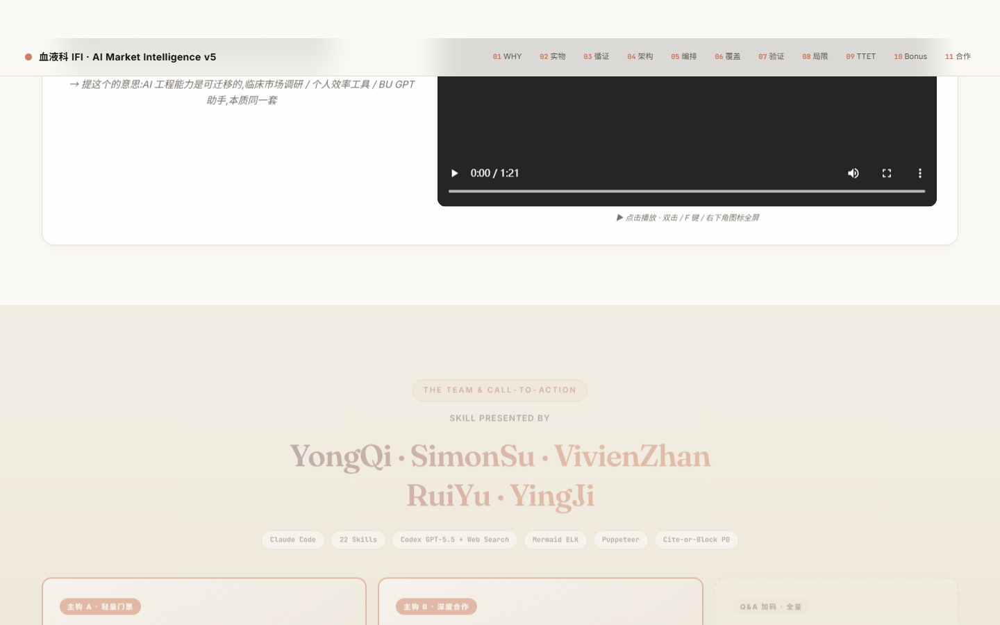

# Editorial Presentation Skill · HTML + PPTX

> **Anthropic warm editorial 设计语言的可复用 skill**
> 从 Pfizer 血液科市场调研 v5 desktop presentation 提炼，支持 HTML（100%）与 PPTX（85-90%）双模输出。
> 只要场景是 presentation，直接告诉 Claude——无需指定风格，自动调用。

---

## 效果预览

### 双柱图 · 患者旅程叙事


### 证据金字塔 · 漏斗 + 5 级分层


### 架构图 · Phase Pill 流程


### CTA · 团队页


---

## 设计 DNA · 5 大支柱

| 支柱 | 规格 |
|------|------|
| **主背景** | 米色 `#FAF9F5`（噪声纹理 + 多层径向渐变） |
| **主色调** | 赭石红 `#CC785C`（accent）+ 6 品牌辅色语义分配 |
| **标题字体** | Fraunces（衬线）· 大标题渐变文字 |
| **正文字体** | Inter（无衬线）· 清晰易读 |
| **数据字体** | JetBrains Mono · tabular-nums 对齐 |
| **视觉手段** | 软阴影卡片 + 圆角 + 渐变文字 + 微妙噪声纹理 |
| **版面节奏** | eyebrow tag → 大标题 → subtitle → 主组件 → CTA / jump-row |

### 行业垂直主色（自动替换）

```
medical    → 深红   #8B2635   医疗 / 血液 / 制药
tech       → 深海蓝 #1B3A5C   科技 / 工程 / AI
finance    → 林绿   #2D5016   金融 / 投资
education  → 深紫   #4A235A   教育 / 咨询
fashion    → 深绀   #2C1654   时尚 / 品牌
```

---

## 双输出模式

| | HTML 模式 | PPTX 模式 |
|---|---|---|
| **视觉保真度** | 100% | 85-90% |
| **输出格式** | 单文件 `.html` | `.pptx`（python-pptx 生成）|
| **交互** | 平滑滚动 · 浮动导航 · 动效 | 静态 slides |
| **字体** | Google Fonts（Fraunces + Inter + JetBrains Mono）| Cambria + Calibri + Consolas（降级兼容）|
| **尺寸** | 自适应宽度 | 16:9 · 1920×1080 |
| **适用场景** | 浏览器演示 · 可分享链接 · 嵌入视频 | 高管会议 · 客户需要文件 · 传统企业 |

---

## 12+ 视觉组件

| 类别 | 组件 |
|------|------|
| **数据图表** | 双柱图（患者旅程）· 5级金字塔 · 文献漏斗 · proof bars · stat-bar |
| **流程类** | phase pill · wf-phase · ttet-step · arch-overview hub 矩阵 |
| **导航跳转** | jump-row · subpage-card · aux-card |
| **CTA / Callout** | cta-grid · data-pain callout · iron-rule-band · anti-pattern callout |
| **品牌卡片** | product-card · dual-products · glass eyebrow |

---

## 文件结构

```
editorial-presentation-html/
├── SKILL.md                    # 主 skill 入口（Claude 读取）
├── references/
│   ├── design-tokens.md        # 完整 :root CSS 变量 + PPT RGB 映射
│   ├── typography.md           # 三字体系统规则 · 字号 scale · spacing
│   ├── components.md           # 12+ 组件 HTML+CSS 代码片段
│   └── pptx-mode.md            # PPTX 实现指南 · python-pptx EditorialDeck 类
├── assets/
│   ├── starter-template.html   # 最小可运行骨架（含完整 design tokens）
│   └── generate_pptx.py        # python-pptx EditorialDeck 类（45KB）
├── evals/
│   └── evals.json              # 5 个触发验证用例
└── screenshots/                # 风格展示截图
```

---

## 安装

```bash
# 克隆到全局 skill 目录
git clone https://github.com/Ethan-YoungQ/editorial-presentation-skill.git \
  ~/.claude/skills/editorial-presentation-html

# 或克隆到项目级 skill 目录
git clone https://github.com/Ethan-YoungQ/editorial-presentation-skill.git \
  .claude/skills/editorial-presentation-html
```

PPTX 模式需要安装 python-pptx：

```bash
pip install python-pptx
```

---

## 使用方式

安装后无需特殊配置，直接告诉 Claude：

### HTML 模式（默认）

```
帮我做一个关于 [主题] 的 presentation，
内容包括 [核心数据]，要给 [受众] 看，
风格专业，可以在浏览器演示。
```

### PPTX 模式

```
帮我做一份 .pptx，关于 [主题]，
涉及 [数据]，要给 [受众]，
客户机器可能没有特殊字体。
```

### HTML 转 PPTX

```
把这份 [文件名].html 转成 PPT 版，
内容数据完全一致，格式要 .pptx。
```

**Claude 自动触发条件**（无需指定风格名）：

- "做一个 presentation / slides / PPT / 幻灯片"
- "做 case sharing / 案例分享 / 项目复盘"
- "给老板 / director / VP / 投资人看"
- "类似血液科那套 / Pfizer 风格 / warm editorial"

---

## 适用场景

✅ **推荐使用**

- 医药 / 咨询 / 科技公司内部汇报
- 给销售总监 / VP / 投资人的 case sharing
- 产品发布 / 项目复盘 / 战略叙事
- 需要视觉专业感的单人演示

❌ **不适合**

- 需要多人协同编辑的文档（用 Notion / Google Slides）
- 超大数据表格（行数 > 50，用 Excel）
- 需要实时数据更新的 dashboard

---

## 设计哲学

> **克制胜于堆砌 · 结构优先于装饰 · 叙事驱动版面**

- 颜色语义化，不装饰化——每种颜色代表一个信息层级
- 字体三分工：衬线做标题气场，无衬线做正文清晰度，等宽做数据精确感
- 留白是设计，不是空白——版面节奏比信息密度更重要
- 每个 section 都是一个完整的论点，不是 bullet list 的堆砌

---

## 源版本参考

本 skill 提炼自：`血液科市场调研_v5_desktop.html`（90KB · 11 sections · 2026-04-27 交付）

技术栈：纯 HTML/CSS + Google Fonts · 零依赖 · 无框架 · 单文件可分享

---

*Made with Claude Code · editorial-presentation-skill v1.0*
