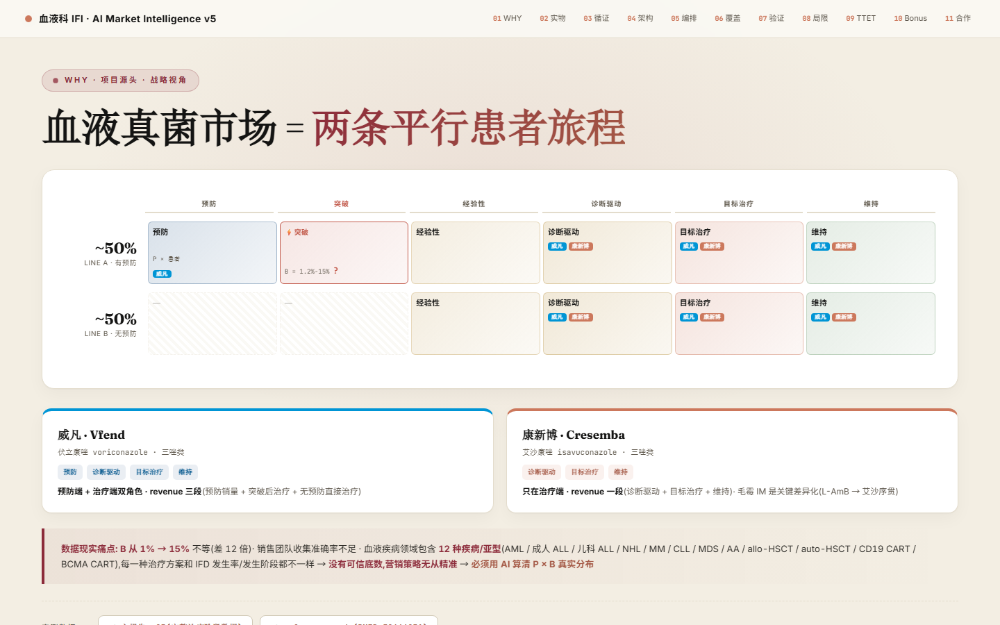

# editorial-presentation-html

**English** | [中文](README_zh.md)

A variable warm-editorial presentation system for fullscreen HTML decks and programmatic PPTX output.

The skill preserves a recognizable editorial design DNA without forcing every subject into the same beige palette, equal-card grid, and eleven-slide story. It selects a style profile, plans a semantic slide manifest, applies deterministic novelty penalties, and validates repetition before rendering.

## Core Workflow

1. Classify purpose, audience, formality, density, output format, and visual latitude.
2. Select one compatible profile from `references/style-index.json`.
3. Build a shared HTML/PPTX manifest with `assets/plan_deck.py`.
4. Render from composition grammar rather than page-template names.
5. Validate semantics, adjacency, geometry runs, tone cadence, card share, viewport behavior, and PPTX package boundaries.

```bash
python assets/plan_deck.py brief.json -o deck-manifest.json
python assets/plan_deck.py deck-manifest.json --validate-only
python assets/render_manifest.py deck-manifest.json --output-dir output/deck
```

The same brief, profile, and seed produce the same manifest. Variation is controlled by content and profile selection, not uncontrolled randomness.

## Design Architecture

| Layer | Responsibility |
|---|---|
| Invariant DNA | Editorial materiality, evidence readability, role-based type, fixed-stage behavior, accessible contrast |
| Style profile | Palette roles, typography roles, scheme, material treatment, composition grammar, background cadence |
| Semantic plan | Narrative role, data relation, cardinality, series count, density, uncertainty, media |
| Novelty planner | Penalizes recently used composition, geometry, tone, and annotation anatomy |
| Quality gate | Rejects semantic misuse, repeated anatomy, viewport failures, and false font-embedding claims |

The included profiles cover the original warm-paper/terracotta look plus cobalt, sage/oxblood, charcoal/citrus, and teal/scarlet editorial directions. Profiles declare whether they support HTML, PPTX, or both.

## Composition Grammar

The planner can choose statement, dominant-metric, asymmetric chart, comparison split, evidence ledger, process rail, matrix with marginalia, small multiples, image/text offset, and editorial mosaic structures.

For a 10-12 slide deck, the default gate expects at least five composition IDs and four dominant geometries when the content permits. Adjacent non-continuation slides cannot share a composition, and no three-slide run may share the same geometry or tone.

## Output Modes

| | HTML | PPTX |
|---|---|---|
| Shell | `assets/deck-shell.html` | `assets/generate_pptx.py` |
| Canvas | `100vw × 100vh` | 16:9 |
| Navigation | Keyboard, wheel, touch, dots, ESC overview | Native slide navigation |
| Planning | Shared manifest | Shared manifest |
| Profiles | All declared HTML profiles | Profiles declaring PPTX support |
| Font handling | Web/system fallback | Verified PowerPoint embedding or explicit fallback |

`assets/starter-template.html` remains only as a legacy Pfizer component gallery. It is not the default shell or a deck blueprint.

## PPTX Example

```python
import json
from assets.generate_pptx import EditorialDeck

manifest = json.load(open("deck-manifest.json", encoding="utf-8"))
deck = EditorialDeck(
    industry="tech",
    style_profile=manifest["deck_profile"],
    manifest=manifest,
    embed_fonts=False,
)
# Add slides according to manifest composition and semantic decisions.
deck.save("output/deck.pptx")
```

When font embedding is requested, the helper requires real desktop Microsoft PowerPoint, verifies requested fonts, `ppt/fonts/`, and `embeddedFontLst`, and rejects WPS false-success paths.

## Preview




## Repository Structure

```text
editorial-presentation-html/
├── SKILL.md
├── README.md
├── README_zh.md
├── assets/
│   ├── deck-shell.html
│   ├── starter-template.html
│   ├── plan_deck.py
│   ├── render_manifest.py
│   ├── generate_pptx.py
│   └── embed_pptx_fonts.ps1
├── references/
│   ├── style-index.json
│   ├── visual-grammar.md
│   ├── design-tokens.md
│   ├── typography.md
│   ├── chart-selection.md
│   ├── components.md
│   ├── layouts.md
│   ├── qa.md
│   └── pptx-mode.md
└── evals/
    └── evals.json
```

## Installation

```bash
git clone https://github.com/EthanYoQ/editorial-presentation-skill.git \
  ~/.claude/skills/editorial-presentation-html
pip install python-pptx Pillow
```

See `SKILL.md` for the complete operating contract and `references/visual-grammar.md` for the planning and anti-repetition rules.
