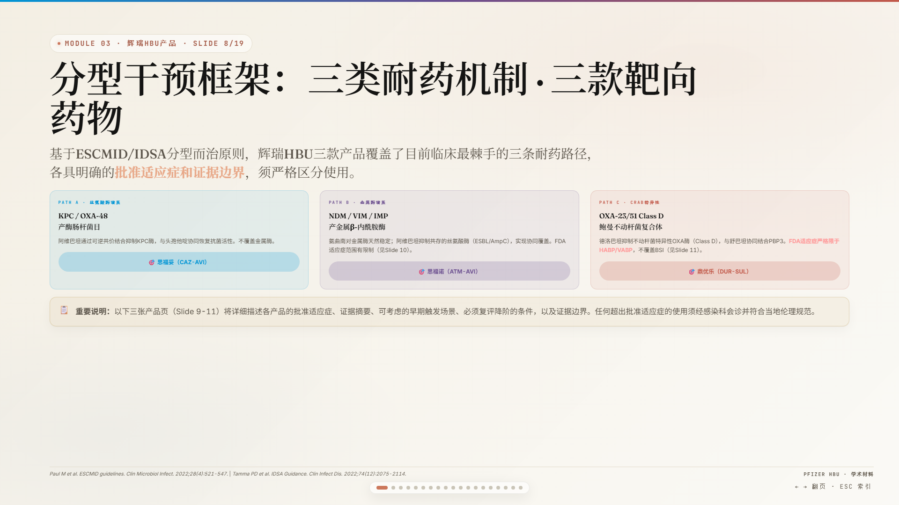
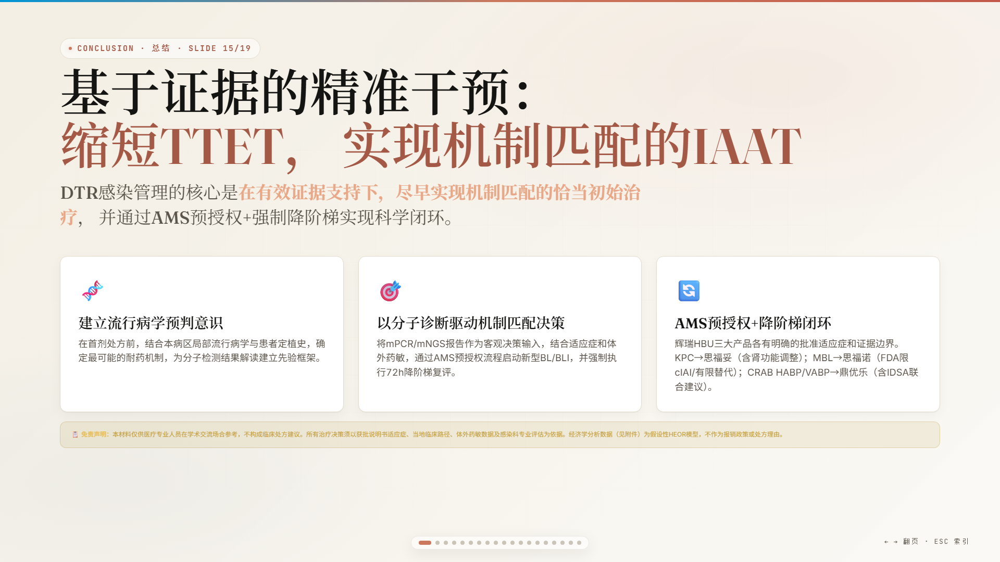
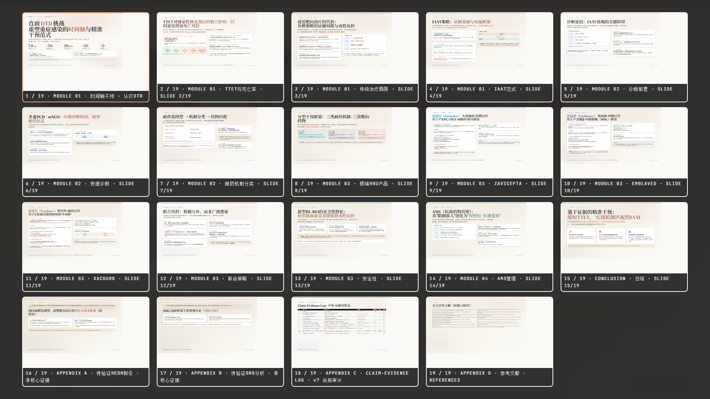

<div align="center">

**English** | [中文](README_zh.md)

</div>

# YQ Editorial Presentation Skill

> A warm editorial presentation skill for browser-first slide decks and PPTX handoff.

This skill turns presentation requests into full-screen horizontal HTML decks with the Pfizer hematology v5 warm editorial palette, guizang-scale projection typography, relationship-aware chart selection, and optional PPTX generation.

---

## Preview

### Projection-Scale Hero


### Mechanism Matrix


### Conclusion Cards


### ESC Overview


---

## What Changed In This Version

- Skill name changed to **YQ Editorial Presentation Skill**.
- HTML mode is now a true `100vw x 100vh` horizontal deck.
- Projection typography is aligned to guizang-style fullscreen decks:
  - hero titles: 110px+ target
  - regular titles: 90-106px target at 1920x1080
  - lead text: 28-36px target
- Warm editorial visual DNA is preserved:
  - cream background `#FAF9F5`
  - ochre accent `#CC785C`
  - hematology crimson `#8C2B3A`
  - Pfizer blue `#0095D5`
  - Fraunces / Inter / JetBrains Mono
- Chart generation now chooses by data relationship instead of defaulting to bars.
- Existing HTML rewrite mode includes QA rules for fullscreen, overview, footer overlap, sunk slides, and typography scale.

---

## Design DNA

| Layer | Rule |
|---|---|
| Background | Warm cream with subtle noise and radial editorial light |
| Accent | Ochre red plus medical crimson, Pfizer blue, green, gold, purple |
| Heading | Fraunces serif for authority and editorial contrast |
| Body | Inter for dense but readable clinical / business narration |
| Data | JetBrains Mono and tabular numerals |
| Layout | Eyebrow tag -> large title -> lead -> relationship component -> footer |
| Deck Shell | Horizontal fullscreen slides, keyboard / wheel / touch navigation, ESC overview |

---

## Chart Selection Rules

The skill no longer turns every number into a bar chart.

| Data relationship | Use |
|---|---|
| One important number | `stat-card` / big number |
| Multiple independent KPIs | `stat-grid` / `stat-strip` |
| Time window or sequence | `timeline` / `decision-window` |
| Step-by-step process | `pipeline` / `phase-pill` |
| Mechanism / genotype / product matching | `matrix` / `gene-drug-map` |
| Literature screening | `funnel` |
| Evidence level | `pyramid` / `evidence-ladder` |
| Same metric across objects | `proof-bars` / ranked bars |
| Patient journey coverage | `market-bars` |

Hard rule: independent KPIs, time windows, mechanism matching, evidence chains, and decision flows must not be forced into generic bar charts.

---

## Output Modes

| | HTML Mode | PPTX Mode |
|---|---|---|
| Fidelity | Highest | 85-90% |
| Format | Single `.html` file | `.pptx` generated by python-pptx |
| Navigation | Left/right, wheel, touch, dots, ESC overview | Native slide navigation |
| Canvas | `100vw x 100vh`, no vertical page scroll | 16:9 |
| Best for | Live browser presenting, teaching, strategy walkthroughs | Client handoff, executive decks |

---

## Repository Structure

```text
editorial-presentation-skill/
├── SKILL.md
├── README.md
├── README_zh.md
├── assets/
│   ├── starter-template.html
│   └── generate_pptx.py
├── references/
│   ├── design-tokens.md
│   ├── typography.md
│   ├── chart-selection.md
│   ├── components.md
│   ├── layouts.md
│   ├── rewrite-existing-html.md
│   ├── qa.md
│   └── pptx-mode.md
├── evals/
│   └── evals.json
└── screenshots/
```

---

## Installation

Clone this repository into your skills directory:

```bash
git clone https://github.com/EthanYoQ/editorial-presentation-skill.git \
  ~/.claude/skills/yq-editorial-presentation-skill
```

PPTX mode requires:

```bash
pip install python-pptx
```

---

## Usage

HTML mode is the default:

```text
Create a presentation about [topic] for [audience].
Use browser fullscreen delivery and keep it suitable for live teaching.
```

Rewrite an existing HTML deck:

```text
Use YQ Editorial Presentation Skill to rewrite this HTML deck.
Preserve all content, but update the shell, layout, typography, and chart expression.
```

PPTX mode:

```text
Create a PPTX version of this presentation with the same warm editorial design language.
```

---

## QA Expectations

Generated HTML decks should pass:

- slide count preserved for rewrite jobs
- no vertical page scrollbar at `1920x1080` and `1440x900`
- ESC overview shows every slide
- regular title median approaches 90-106px at `1920x1080`
- lead text remains projection-readable
- footer does not overlap chart or evidence text
- `dense-slide` is not treated as `compact`
- at least three chart expression families unless the content has only one relationship type

---

## License

Use and adapt for your own presentation workflows.
