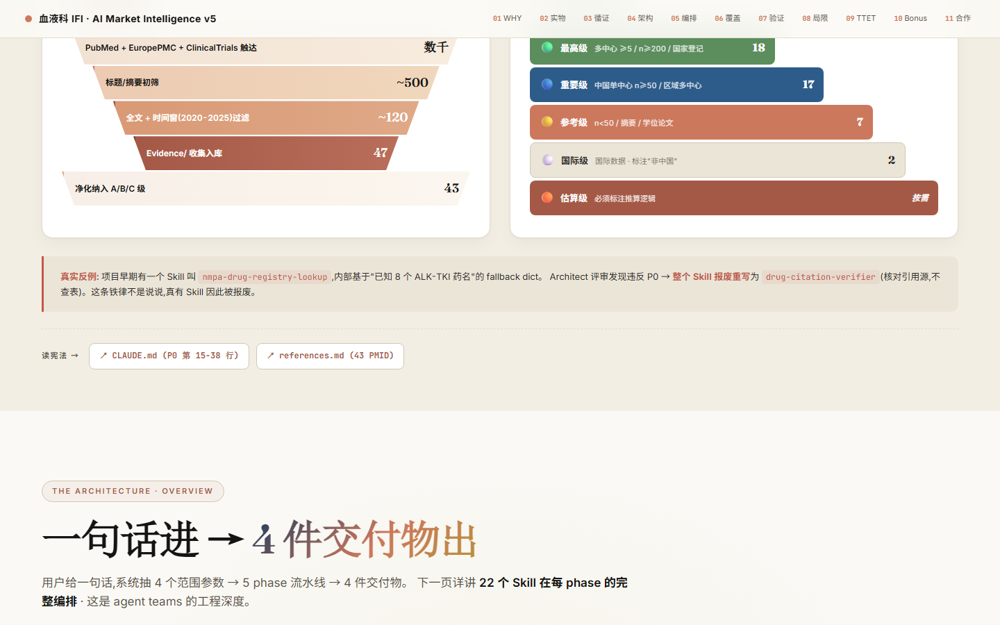
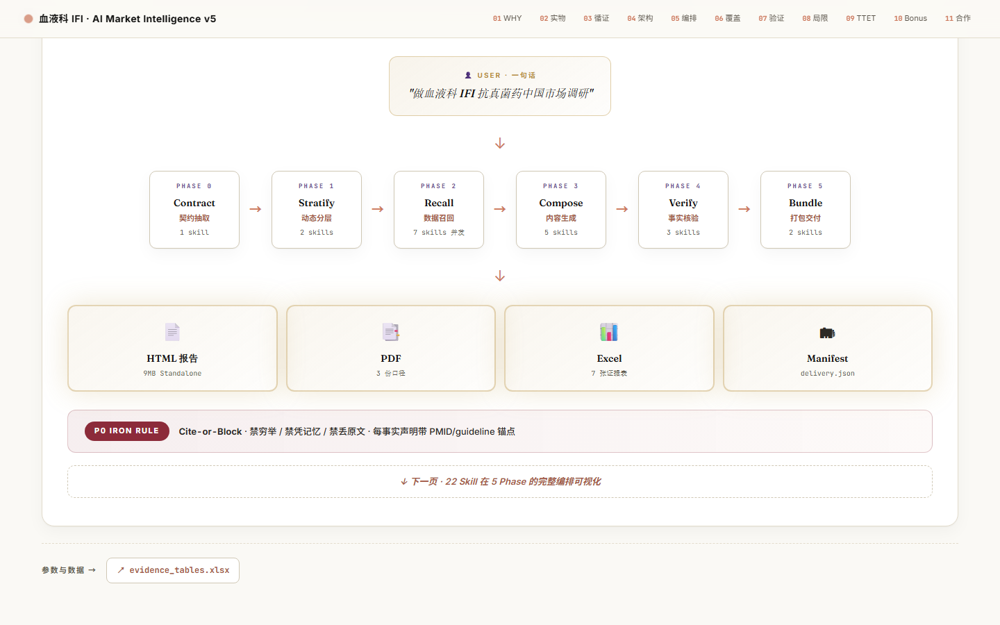

# yq-editorial-presentation-html

[English](README.md) | **中文**

一套可变体的 warm editorial 演示设计系统，用于生成横向全屏 HTML deck 和程序化 PPTX。

该 Skill 在保留可识别的编辑设计 DNA 的同时，不会把所有主题都套进同一套米色配色、等宽卡片网格和固定 11 页叙事。它会先选择 style profile，规划语义化 slide manifest，通过确定性的新颖度惩罚减少重复，并在渲染前校验构图重复问题。

## 核心工作流

1. 判断演示目的、受众、正式度、信息密度、输出格式和视觉发挥空间。
2. 从 `references/style-index.json` 中选择一个兼容的 profile。
3. 使用 `assets/plan_deck.py` 构建 HTML 与 PPTX 共用的 manifest。
4. 按构图语法渲染，而不是按固定页面模板名称套版。
5. 校验语义适配、相邻页面、连续几何、tone 节奏、卡片占比、视口行为和 PPTX 包边界。

```bash
python assets/plan_deck.py brief.json -o deck-manifest.json
python assets/plan_deck.py deck-manifest.json --validate-only
python assets/render_manifest.py deck-manifest.json --output-dir output/deck
```

相同的 brief、profile 和 seed 会生成相同的 manifest。变化由内容与 profile 选择控制，不依赖不可控的随机结果。

## 设计架构

| 层级 | 职责 |
|---|---|
| 不变 DNA | 编辑质感、证据可读性、角色化字体、固定舞台行为、无障碍对比度 |
| Style profile | 配色角色、字体角色、明暗方案、材质处理、构图语法、背景节奏 |
| 语义规划 | 叙事角色、数据关系、基数、系列数量、密度、不确定性、媒体条件 |
| 新颖度规划器 | 惩罚近期使用过的构图、几何、tone 和注释结构 |
| 质量门 | 拒绝语义误用、重复结构、视口失败和虚假的字体嵌入声明 |

内置 profile 包括原始的 warm-paper/terracotta 方向，以及 cobalt、sage/oxblood、charcoal/citrus 和 teal/scarlet 等编辑设计方向。每个 profile 都会声明自己支持 HTML、PPTX 或两者：`charcoal-citrus-briefing` 仅支持 HTML，其余四个内置 profile 同时支持 HTML 和 PPTX。

## 构图语法

规划器可以选择全幅陈述、主导指标、不对称图表、对比分栏、证据台账、流程轨道、带边注的矩阵、小多图、错位图文和编辑式马赛克等结构。

对于 10-12 页的 deck，在内容允许时，默认质量门期望至少出现 5 个构图 ID 和 4 种主几何；未达到这两个多样性目标时会产生警告。相邻的非续页不能使用同一构图，任意连续 3 页不能使用同一主几何或 tone；这些重复会导致 manifest 校验失败。非标题页中的通用马赛克或卡片式结构占比超过 40% 时同样会校验失败。

## 输出模式

| | HTML | PPTX |
|---|---|---|
| Shell | `assets/deck-shell.html` | `assets/generate_pptx.py` |
| 画布 | `100vw × 100vh` | 16:9 |
| 导航 | 键盘、滚轮、触摸、圆点、ESC overview | PowerPoint 原生幻灯片导航 |
| 规划 | 共用 manifest | 共用 manifest |
| Profiles | 所有声明支持 HTML 的 profile | 仅声明支持 PPTX 的 profile |
| 字体处理 | Web 字体或系统字体回退 | 经验证的 PowerPoint 字体嵌入，或明确回退 |

`assets/starter-template.html` 仅保留为旧版 Pfizer 组件展示，不再是默认 shell，也不是 deck 蓝图。

共享 renderer 会先验证 manifest，再生成 `deck.html`、`deck.pptx` 和 `render-report.json`。它会把同一份 manifest 的 SHA256 写入两种输出，并记录每页的 composition 与 major-region signature。只需要一种格式时，可以分别使用 `--html-only` 或 `--pptx-only`。

## PPTX 示例

```python
import json
from assets.generate_pptx import EditorialDeck

manifest = json.load(open("deck-manifest.json", encoding="utf-8"))
deck = EditorialDeck(
    industry="tech",
    style_profile=manifest["deck_profile"],
    manifest=manifest,
    embed_fonts=False,
)
# Add slides according to manifest composition and semantic decisions.
deck.save("output/deck.pptx")
```

当请求嵌入字体时，辅助程序要求使用真正的桌面版 Microsoft PowerPoint，并会验证请求的字体、`ppt/fonts/` 和 `embeddedFontLst`。WPS 产生的虚假成功路径会被拒绝。

## 预览






## 仓库结构

```text
yq-editorial-presentation-html/
├── SKILL.md
├── README.md
├── README_zh.md
├── assets/
│   ├── deck-shell.html
│   ├── starter-template.html
│   ├── plan_deck.py
│   ├── render_manifest.py
│   ├── generate_pptx.py
│   └── embed_pptx_fonts.ps1
├── references/
│   ├── style-index.json
│   ├── visual-grammar.md
│   ├── design-tokens.md
│   ├── typography.md
│   ├── chart-selection.md
│   ├── components.md
│   ├── layouts.md
│   ├── qa.md
│   └── pptx-mode.md
└── evals/
    └── evals.json
```

## 安装

```bash
git clone https://github.com/EthanYoQ/editorial-presentation-skill.git \
  ~/.claude/skills/yq-editorial-presentation-html
pip install python-pptx Pillow
```

完整运行约束见 `SKILL.md`；规划与反重复规则见 `references/visual-grammar.md`。
