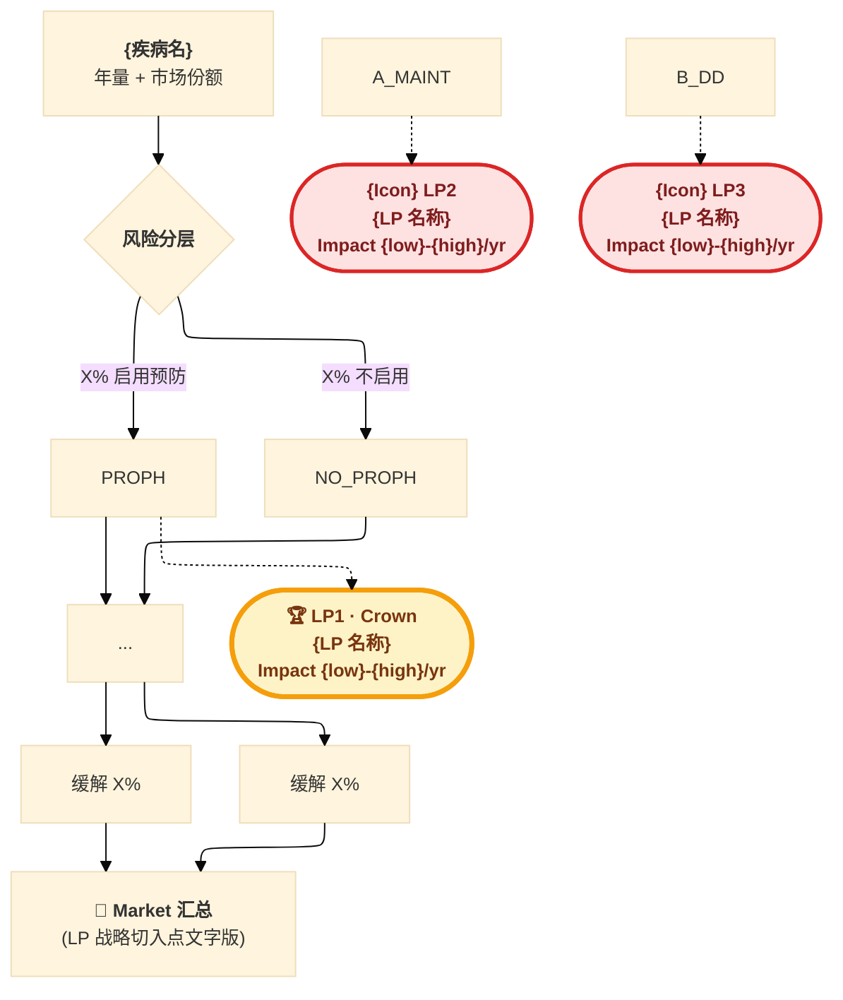
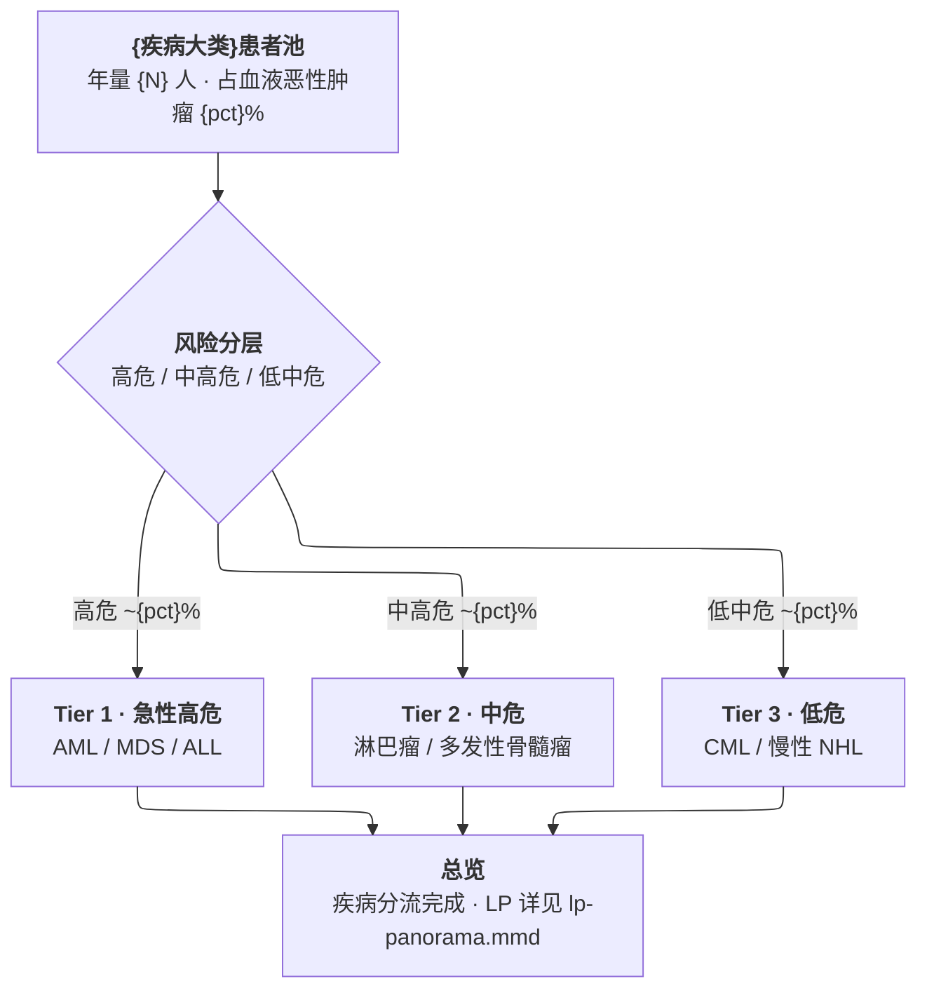
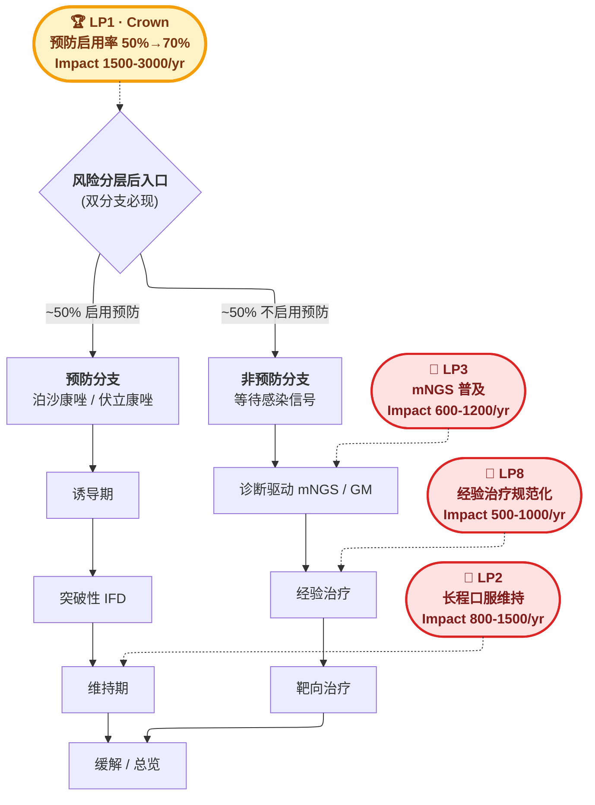

# 决策树 + LP 节点嵌入 Skill (L2 · 复用组件)

> **L2 工具组件**:本 skill 提供"决策树 + LP 切入点"在 Mermaid 流程图中的**节点级嵌入规范**。
> 设计目标:让任何疾病领域的决策树流程图在节点级直接可见 LP 切入点,不再依赖单独的 LP 决策图。
> 上游依赖:`market-sizing-mece-foundation` (L0 §10 LP 决策图规范) + `ifi-market-sizing-skill` (L1)

> **v1.1 变更说明 (2026-04-25)** · 新增规则 10 + 规则 11(主图禁嵌 LP / LP 图必须双分支)。
> 触发原因:血液科 v2.5 第 6 次迭代交付时主图嵌入 8 个 LP_BADGE,用户立即指出"主图(疾病分流总览)语义只承担疾病分流,加 LP 是双语义混淆"。同时旧版 LP 全景图所有 LP 连到线性高危/中高危瀑布,忽略非预防分支,违背 LP 应"双分支分流"的本质。本次新增 2 条 Iron Law 把这两类失败模式钉死。

## 一句话定义

把"决策树主干"与"LP 切入点 badge"用**虚线连接 + stadium 节点 + classDef 配色**的方式融合到一张 Mermaid 流程图,使读者一眼看到"哪个临床阶段对应哪个杠杆点 + 量化 Impact"。

---

---

## 核心规范(Iron Law · 不可违反)

### 规则 1:LP 必须以独立节点出现,不可混在业务节点 label 内

❌ **错误示例**:
```mermaid
PROPH["<b>① 一级预防</b><br/>泊沙康唑 35%<br/>🏆 LP1 预防结构优化"]
```
LP 标签被业务正文稀释,视觉淹没,失去战略提示作用。

✅ **正确示例**:
```mermaid
PROPH["<b>① 一级预防</b><br/>泊沙康唑 35% · 伏立 25%"]
LP1_BADGE(["<b>🏆 LP1 · Crown</b><br/>预防结构优化<br/>Impact 1,500-3,000/yr"])
PROPH -.-> LP1_BADGE
```

### 规则 2:LP 节点用 stadium 形状(圆角矩形)

```mermaid
LP_X_BADGE(["..."])
```
- 与决策方块 `[]` 区分(避免读者误以为 LP 是流程节点)
- 与判断菱形 `{}` 区分(LP 不是决策点)
- stadium `(["..."]) ` 的"奖章/徽章"语义明确

### 规则 3:LP 与业务节点用虚线 `-.->` 连接

```mermaid
PROPH -.-> LP1_BADGE
```
- 实线 `-->` 是流程进展(打断主流)
- 虚线 `-.->` 是"附加注释/战略提示"(不打断主流)
- ELK 布局对虚线支持良好,会从主流向旁路偏移

### 规则 4:LP 配色用 `lpcrown` (金) + `lpstd` (红)

```css
classDef lpcrown fill:#FEF3C7,stroke:#F59E0B,stroke-width:3.5px,color:#78350F,font-weight:bold
classDef lpstd fill:#FEE2E2,stroke:#DC2626,stroke-width:2.5px,color:#7F1D1D,font-weight:bold
class LP1_BADGE lpcrown
class LP2_BADGE,LP3_BADGE,LP4_BADGE lpstd
```

- **金色** = Crown LP(战略最重要、不可被取代)
- **红色** = Standard LP(常规 LP,体现紧急程度)
- 边框粗细对比(3.5px vs 2.5px)凸显 Crown 优先级

### 规则 5:每个 LP_BADGE 必含三要素

```
<b>{Icon} LP{N} · {Tier 标签}</b>
{LP 名称简化版}
Impact {low}-{high}/yr · {关键缺口数据}
```

示例:
```
<b>🏆 LP1 · Crown</b>
预防启用率 50% → 70%
Impact 1,500-3,000/yr · 指南-RWE 20pp 缺口
```

### 规则 6:每张子页决策树嵌入 2-3 个 LP(主页主图嵌 6-8 个)

| 图类型 | LP 数量 | 选择标准 |
|------|--------|--------|
| 子页(独立疾病决策树) | 2-3 个 | TOP Impact + Crown 1 个 + 业务节点匹配度 |
| 主页主图(疾病分流总览) | **0 个**(规则 10 严禁) | 主图只承担疾病分流语义，LP 单独成 lp-panorama.mmd |

子页 LP 数量过多 → 视觉杂乱,失去战略焦点;过少 → 缺少行动指引。**TOP 3 是最佳平衡**。

### 规则 7:LP_BADGE 命名约定 = `LP{N}_BADGE`

- `LP1_BADGE / LP2_BADGE / .../ LP8_BADGE`
- 不用 `LP_PREVENTION` / `LP_STRUCTURE` 等语义命名 — 跨疾病不可移植
- 数字编号 + `_BADGE` 后缀 = 通用、可复用、跨子图一致

### 规则 8:LP 必须连接到"动作发生"节点而非"风险评估"节点

✅ 正确连接示例:
- LP1 (预防启用率) → `PROPH` (一级预防药物节点) 或 `RISK` (风险分层判断,准备启用预防)
- LP2 (长程口服) → `A_MAINT` (维持期节点)
- LP3 (mNGS 普及) → `B_DD` (诊断驱动节点)
- LP4 (CAR-T 共识) → `PROPH` 或 `A_BREAK` (突破性 IFD 节点)

❌ 错误连接:
- 不要连接到 `HEAD`(顶层患者池信息节点)
- 不要连接到 `END_*`(终止节点)— LP 是行动机会,不是结局
- 不要连接到纯展示节点(SUMMARY、统计框)

### 规则 9:`-.->` 不计入 linkStyle 主路径着色

**主路径着色**(色彩编码业务流):
```mermaid
linkStyle 0 stroke:#1E8449,stroke-width:3.5px
linkStyle 1 stroke:#CB4335,stroke-width:3.5px,stroke-dasharray: 5 3
```

LP 虚线由 classDef 控制视觉,不要再用 linkStyle 覆盖,避免冲突。

### 规则 10:主图(disease-flow-map)不嵌入 LP_BADGE

主图(疾病分流总览图 / 市场分级图 / 病程总览图)的语义是"疾病/病种之间的分流",**一图一主题**。叠加 LP 会让视觉同时承担 2 个语义(疾病分流 + 杠杆点),读者无法分辨"这条线是病程进展还是 LP 标注"。

**LP 嵌入只适用于以下两类图**:
1. **LP 全景决策图**(独立的战略图,所有 LP 集中在一张图)
2. **各子页决策树**(节点级标注 TOP 3 LP,聚焦单一疾病的可执行机会)

❌ **错误示例**(血液科 v2.5 第 6 次迭代):
```mermaid
%% disease-flow-map.mmd 主图
PATIENT_POOL --> RISK_STRATIFY --> AML_T1 & MDS_T1 & ALL_T1 & LYM_T2 & MM_T2 & CML_T3
LP1_BADGE -.-> AML_T1
LP2_BADGE -.-> MDS_T1
LP3_BADGE -.-> ALL_T1
LP4_BADGE -.-> LYM_T2
LP5_BADGE -.-> MM_T2
LP6_BADGE -.-> CML_T3
LP7_BADGE -.-> AML_T1
LP8_BADGE -.-> MDS_T1
%% 8 个 LP_BADGE 全连到 6 个 disease tier 节点 → 视觉双语义混淆
```

✅ **正确示例**:
```mermaid
%% disease-flow-map.mmd 主图(无 LP)
PATIENT_POOL --> RISK_STRATIFY --> AML_T1 & MDS_T1 & ALL_T1 & LYM_T2 & MM_T2 & CML_T3
%% 主图只画"疾病池 → 风险分层 → 6 个 disease tier → 总览",LP 单独成图
```

LP 全景图独立成 `lp-panorama.mmd`,子页决策树各嵌 TOP 3 LP — 主图始终保持纯净的疾病分流语义。

### 规则 11:LP 决策图必须双分支(或多分支)

LP 全景决策图的入口必须显式标出**双分支或多分支分流**(例:预防分支 ~50% / 非预防分支 ~50%)。每个 LP_BADGE 必须连接到"具体分支的具体动作节点",**不能只连到入口或汇总节点**。

**验收标准**:LP 全景图必须能让读者一眼判断"该 LP 影响哪个分支的多少患者"。

❌ **错误示例**(旧 v2.1 LP 全景图):
```mermaid
%% 所有 LP 连到"高危/中高危/低中危"线性瀑布,忽略非预防分支
ENTRY --> HIGH_RISK --> MID_HIGH --> LOW_MID --> END
LP1_BADGE -.-> HIGH_RISK
LP2_BADGE -.-> MID_HIGH
LP3_BADGE -.-> LOW_MID
%% 假设了 100% 启用预防 — 实际仅 ~50% 启用,忽略另外 ~50% 非预防分支的 LP 机会
```

✅ **正确示例**:
```mermaid
ENTRY{"<b>风险分层后</b>"}
ENTRY -->|"~50% 启用预防"| PROPH_BRANCH
ENTRY -->|"~50% 不启用预防"| NO_PROPH_BRANCH
PROPH_BRANCH --> A_INDUC --> A_BREAK --> A_MAINT
NO_PROPH_BRANCH --> B_DD --> B_EMP_TX --> B_TARGET_TX

%% LP1 横跨双分支决策点 — 影响"是否启用预防"的判断
LP1_BADGE -.-> ENTRY
%% LP3 落在非预防分支的诊断节点
LP3_BADGE -.-> B_DD
%% LP8 落在非预防分支的经验治疗节点
LP8_BADGE -.-> B_EMP_TX
%% LP2 落在预防分支的维持节点
LP2_BADGE -.-> A_MAINT
```

每个 LP 必须能被读者读出"作用在哪个分支 · 影响多少患者占比",而不是被吸进一条单线瀑布里。

---

## 执行流程(决策树作者 SOP)

```
Step 1: 完成主决策树骨架(HEAD → RISK → BRANCH_A/B → 阶段节点 → END)
Step 2: 在 SUMMARY 节点列出 TOP 3 LP 文字版(战略层确定 LP 内容)
Step 3: 在 SUMMARY 之后,新增 LP 嵌入区块:
        - LP_BADGE 节点定义(2-3 个,Crown 优先)
        - 每个 LP 用 -.-> 连接到主流的"动作节点"
        - classDef lpcrown / lpstd 定义
        - class LP*_BADGE 应用 classDef
Step 4: 渲染 PNG (mmdc -w 5500 --scale 2 -b white -p puppeteer-config.json)
        验证:LP_BADGE 视觉醒目 + 虚线偏移不打断主流 + Crown 金色突出
Step 5: 文件大小 ≥ 750 KB,短边 ≥ 3000 px,否则重渲
        回退方案:先尝试 `-w 6000`；若 ELK 布局混乱,改 `layout: dagre` 重渲；
        仍失败则检查 puppeteer-config.json 中 chromium 路径是否正确。
```

---

## 完整模板(直接复制粘贴 · 适配任何疾病)



---

## 主图模板(无 LP) vs LP 全景图模板(双分支) · v1.1 新增对比

> **关键差异**:主图与 LP 全景图是**两张独立的图**,不可合并。下面给出两份最简骨架,用于直接复制粘贴。

### A. 主图模板(disease-flow-map · 无 LP_BADGE)

主图只承担"疾病/病种之间的分流"语义,严禁嵌入任何 LP_BADGE(规则 10)。



### B. LP 全景图模板(lp-panorama.mmd · 双分支强制)

LP 图入口必须显式标出双分支或多分支分流(规则 11),每个 LP 必须连到具体分支的具体动作节点。



### 对比要点

| 维度 | 主图(disease-flow-map) | LP 全景图(lp-panorama) |
|----|--------------------|--------------------|
| 单一语义 | ✅ 仅疾病分流 | ✅ 仅 LP 战略 |
| 入口结构 | 风险分层(3 个 Tier) | **双分支强制**(预防 ~50% / 非预防 ~50%) |
| LP_BADGE 数量 | **0**(严禁) | 6-8 个(全 LP 集中) |
| LP 连接策略 | 不适用 | 连到**具体分支的动作节点**,非入口/汇总 |
| 文件命名 | `disease-flow-map.mmd` | `lp-panorama.mmd` |

---

## 跨疾病移植清单(下次"呼吸科 ICU 真菌"项目)

| 检查项 | 适用方式 |
|------|---------|
| LP_BADGE 节点定义 | ✅ 直接复用 — 改 LP 名称 / Icon / Impact 数字 |
| `-.->` 虚线连接 | ✅ 直接复用 — 改连接到呼吸科决策树的对应节点(如 RICU_PROPH / CAPA_DD) |
| classDef lpcrown / lpstd | ✅ 直接复用 — 配色不变 |
| TOP 3 LP 选择 | 🟡 重新选 — 呼吸科 ICU 的 Crown 通常是"RICU vs 综合 ICU MECE"或"CAPA 共识" |
| LP 数量 | ✅ 子页 2-3 / 主图 6-8 不变 |
| 渲染参数 | ✅ `-w 5500 --scale 2` 不变 |

---

## 失败模式速查

| # | 失败模式 | 根因 | 修复 |
|---|--------|------|-----|
| 1 | LP 标签混在业务节点 label 内 | 旧版用 prefix "🏆 LP1 ..." | 强制独立 LP_BADGE 节点 |
| 2 | LP 用决策方块而非 stadium | mermaid 语法不熟 | `(["..."])` 是奖章语义 |
| 3 | LP 用实线连接打断主流 | `-->` 误用 | 强制 `-.->` 虚线 |
| 4 | LP 配色与业务节点同色 | 缺 classDef | 强制 lpcrown(金)+ lpstd(红) |
| 5 | LP 缺 Impact 数字 | 文字化但无量化 | 强制 `Impact low-high/yr` |
| 6 | 子页嵌 5+ LP 视觉杂乱 | 战略不聚焦 | 强制 TOP 3 上限 |
| 7 | LP 连到 SUMMARY/END 节点 | 选了"结果"而非"行动" | 必须连"动作发生"节点 |
| 8 | LP_BADGE 命名用语义(LP_STRUCTURE) | 跨疾病不可移植 | 强制 `LP{N}_BADGE` |
| 9 | 决策树仅 SUMMARY 文字列 LP | 节点级遗漏(血液科 v2.5 反复出现) | 本 skill 强制节点级嵌入 |
| 10 | 主图嵌入 LP_BADGE(疾病分流图带 LP) | 误把主图当 LP 全景图 · 双语义混淆 | 主图严禁嵌 LP · LP 单独成图(规则 10) |
| 11 | LP 全景图所有 LP 连到单分支线性瀑布 | 假设 100% 启用预防,忽略非预防分支 | LP 图入口必须双分支 · LP 必须连具体分支动作节点(规则 11) |

---

## 验收标准(交付前自检)

- [ ] **主图 .mmd 不含 LP_BADGE**(规则 10 · v1.1 新增)
- [ ] **LP 全景图入口显式标双分支或多分支**(规则 11 · v1.1 新增)
- [ ] **LP 全景图所有 LP 连到具体分支的具体动作节点**,非入口/汇总(规则 11 · v1.1 新增)
- [ ] 每张子页 .mmd 含 2-3 个 `LP{N}_BADGE` 节点定义
- [ ] LP 全景图 .mmd 含 6-8 个 LP_BADGE,按 Tier 连接对应分支动作节点
- [ ] 每个 LP_BADGE 用 stadium `(["..."])` 形状
- [ ] 每个 LP_BADGE 的连接用 `-.->` 虚线
- [ ] 每个 LP_BADGE 含 `Icon · 名称 · Impact 数字` 三要素
- [ ] classDef `lpcrown` / `lpstd` 已定义
- [ ] Crown LP 用 lpcrown(金边)· 其他用 lpstd(红边)
- [ ] LP 连到"动作节点"而非 SUMMARY/END
- [ ] 渲染 PNG ≥ 750 KB,短边 ≥ 3000 px
- [ ] 视觉抽查:LP_BADGE 醒目度 > 业务节点

---

## 版本历史

- **v1.1 (2026-04-25)** · 新增规则 10 + 规则 11(主图禁嵌 LP / LP 图必须双分支)。
  - 触发原因:血液科 v2.5 主图嵌 8 个 LP_BADGE 被用户当场指出"主图不应承担双语义"
  - 旧 v2.1 LP 全景图所有 LP 连到线性高危/中高危瀑布,忽略非预防分支(~50% 患者)
  - 新增内容:规则 10 / 规则 11 + 失败模式 #10 / #11 + "主图模板 vs LP 全景图模板"对比 + 验收清单 3 项

- **v1.0 (2026-04-25)** · 从血液科 v2.5 第 6 次迭代抽出。Iron Law 来源:
  - 失败模式 #28(L1 ifi-market-sizing-skill)— LP 决策图 + 决策树节点级 LP 标注 5 次复现
  - 用户反馈"以前试图做过约束,目前问题一直复现"
  - 解决方案:抽 L2 通用 skill + L1 强约束清单 + L3 编排 workflow

---

## Skill Presented by:YongQi, SimonSu, RuiYu, YingJi
